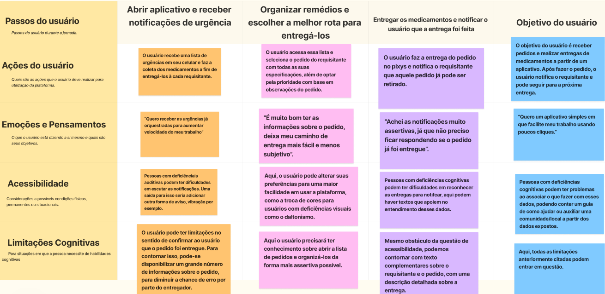
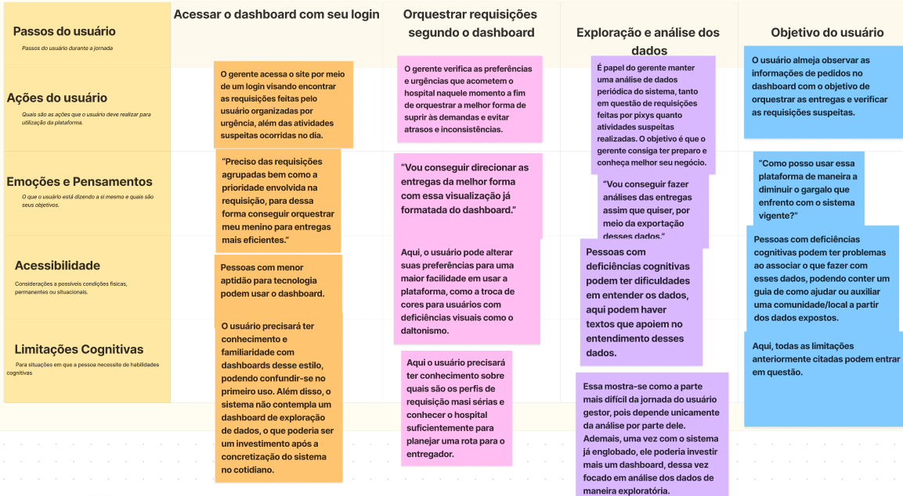

# Mapa de Jornada do Usuário

O mapa de jornada do usuário é uma ferramenta valiosa no design de experiências, proporcionando uma representação visual do processo pelo qual um usuário passa ao interagir com um produto, serviço ou sistema. Este documento descreve as etapas que o usuário atravessa, desde a inicialização do contato com o produto até a realização de seu objetivo final. A análise é feita a partir de três personas distintas, cada uma com um papel específico dentro do contexto do sistema de entrega de medicamentos.

## Persona 1 - Técnica de Enfermagem

**Objetivo da Persona:** Esta persona atua como requisitante de medicamentos, usando o aplicativo para efetuar pedidos.

**Jornada:**
1. **Acesso ao aplicativo:** Inicia ao escanear um QR code.
2. **Pedido de medicamentos:** Realiza o pedido incluindo especificações e observações necessárias.
3. **Acompanhamento e notificação:** Monitora o status do pedido até a notificação de entrega.

**Desafios enfrentados:** A técnica de enfermagem não tem dificuldades significativas com tecnologia, porém, inicialmente, pode enfrentar problemas ao escanear o QR Code. Espera-se que essa dificuldade diminua com a prática.

<!--  -->

## Persona 2 - Técnico da Farmácia Central

**Objetivo da Persona:** Responsável pelas entregas, esta persona utiliza o aplicativo para gerenciar e notificar o status dos pedidos.

**Jornada:**
1. **Receber pedidos:** Obtém as requisições via sistema.
2. **Preparação e entrega:** Organiza e distribui os medicamentos necessários.
3. **Notificação de entrega:** Informa aos requisitantes que o pedido foi concluído.

**Fluxos de trabalho:** Pode variar entre permanecer na farmácia central coordenando os pedidos ou deslocando-se pelo hospital para realizar as entregas.

## Persona 3 - Gerente da Farmácia Central

**Objetivo da Persona:** Esta persona gerencia e analisa o fluxo de pedidos e a eficiência das entregas.

**Jornada:**
1. **Análise das operações:** Monitora o desempenho geral do serviço.
2. **Gestão de equipe:** Coordena as atividades dos técnicos e ajusta os processos conforme necessário.
3. **Melhoria contínua:** Identifica oportunidades de otimização e implementa soluções para melhorar o serviço.

**Localização:** O gerente opera principalmente dentro da farmácia central, gerenciando tanto a logística quanto o pessoal.

## Conclusão

Os mapas de jornada das diferentes personas ajudam a visualizar e entender as interações específicas de cada usuário com o sistema, destacando oportunidades para melhorar a eficiência e a satisfação do usuário. Ao mapear essas jornadas, equipes de desenvolvimento, design e operacional podem trabalhar de forma mais alinhada para atender ou superar as expectativas dos usuários, garantindo um processo fluido e eficaz em todos os níveis da operação de entrega de medicamentos.