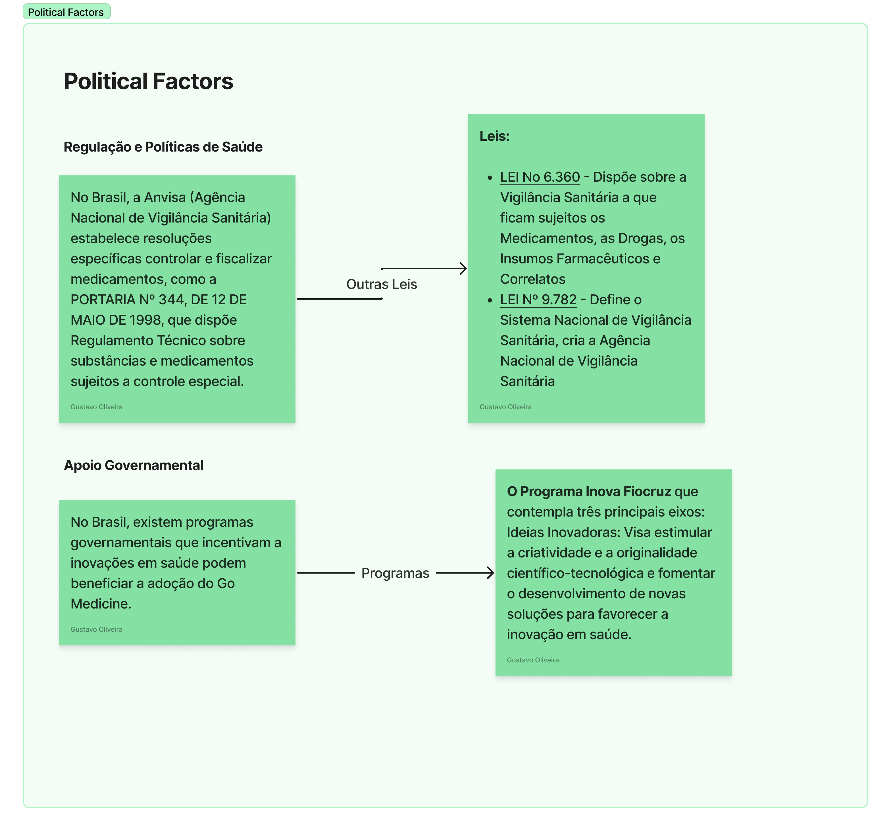
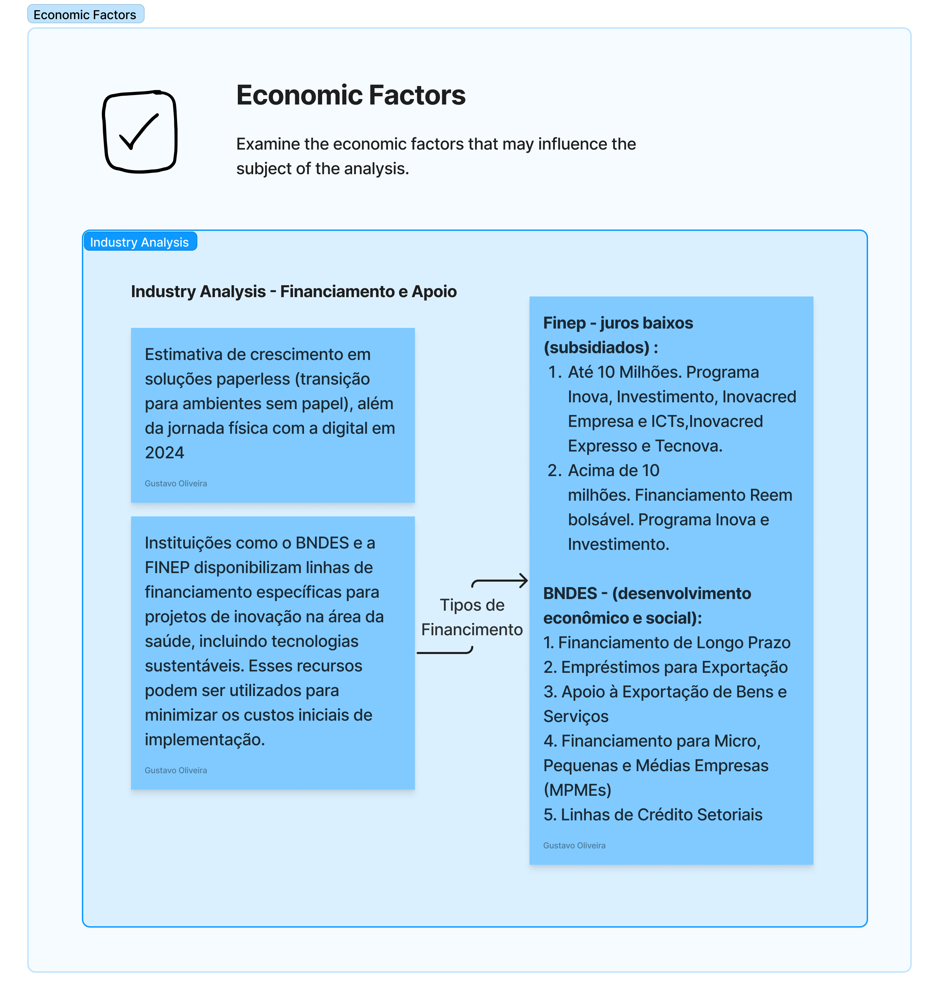
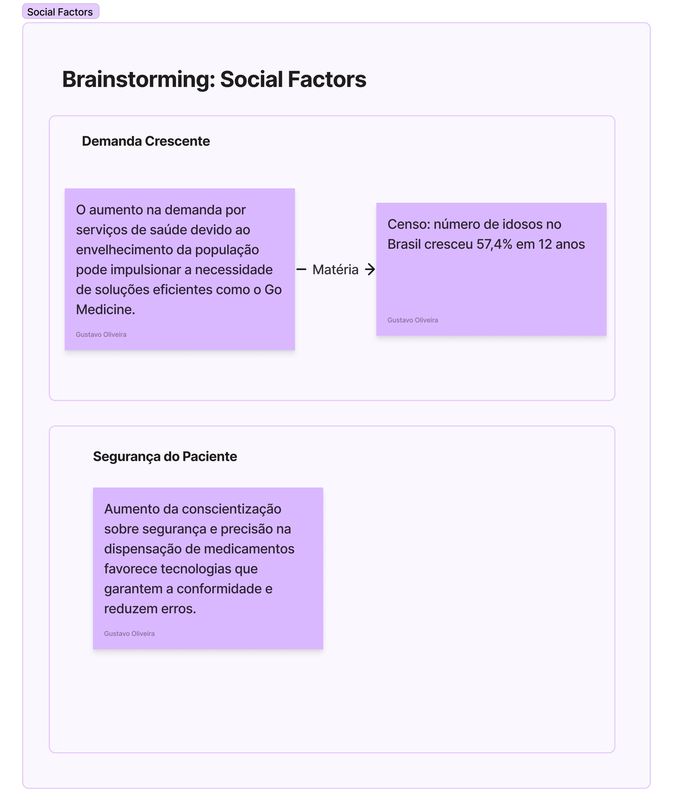
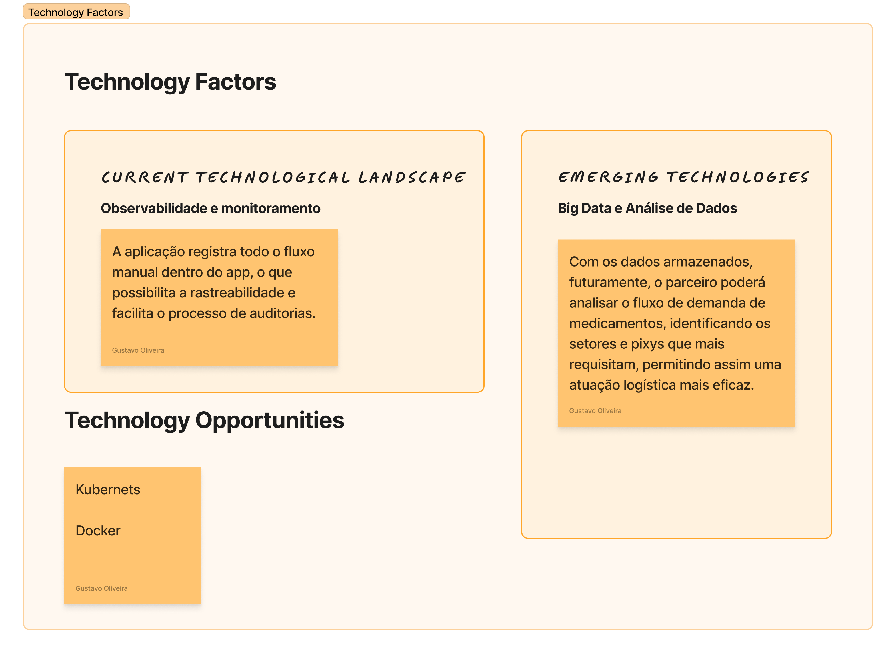
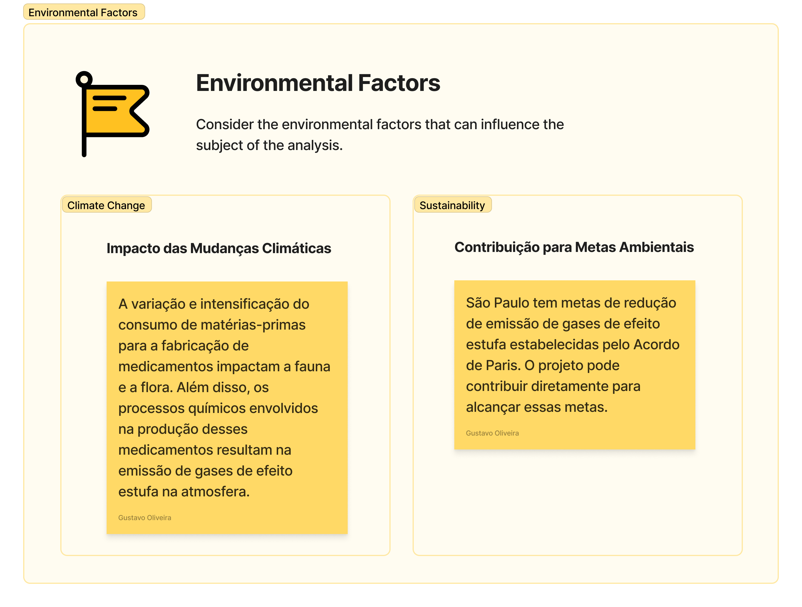
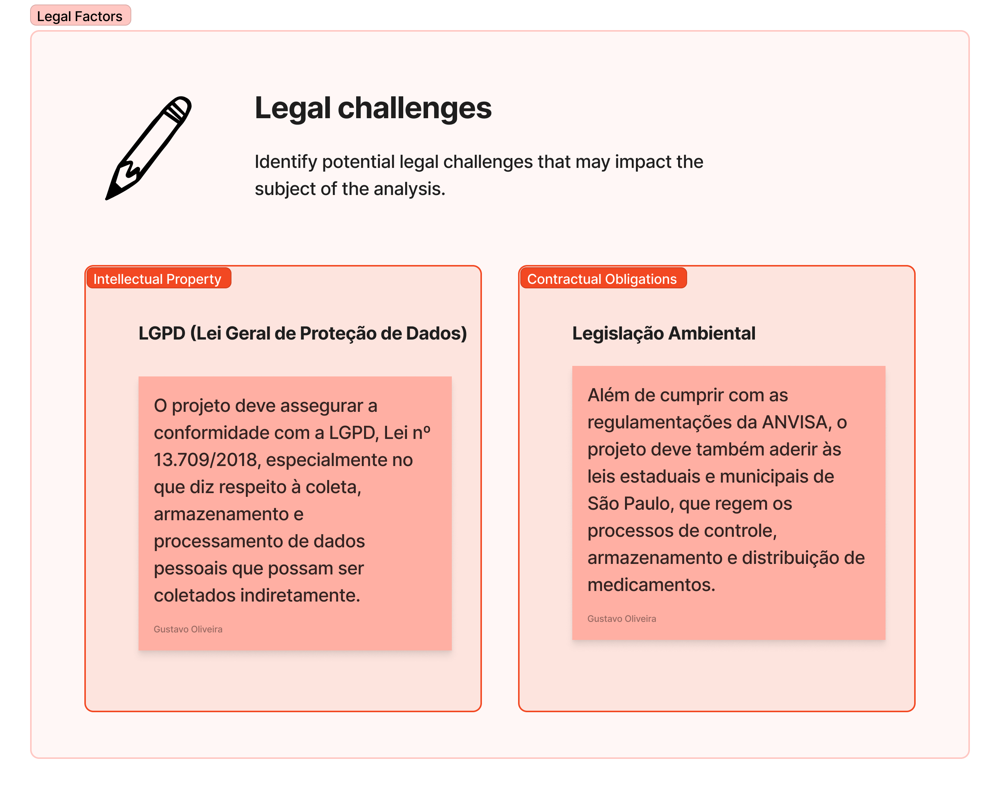

# Análise PESTEL

A análise PESTEL é uma ferramenta estratégica utilizada por organizações para compreender e avaliar o ambiente externo em que operam. Ela envolve a identificação e análise de seis categorias principais de influências macroambientais, fornecendo uma visão abrangente das oportunidades e ameaças que podem impactar a empresa. Aqui está uma descrição detalhada de cada componente:

## Fatores Politicos

Esta categoria abrange fatores relacionados ao ambiente político em que a organização opera. Isso inclui questões como estabilidade política, mudanças de governo, regulamentações governamentais, políticas fiscais e legislação trabalhista. A análise política ajuda a empresa a entender como as decisões políticas podem afetar suas operações, seus mercados-alvo e suas estratégias de negócios.

## Fatores Econômicos

Fatores econômicos referem-se às condições econômicas globais, regionais ou nacionais que afetam a organização. Isso inclui taxas de crescimento econômico, taxas de juros, inflação, desemprego, distribuição de renda e flutuações cambiais. A análise econômica permite que a empresa compreenda o poder de compra dos consumidores, os custos de produção, a demanda do mercado e a viabilidade financeira de seus projetos e investimentos.

## Fatores Sociais

Esta categoria diz respeito aos aspectos socioculturais que moldam o ambiente operacional da empresa. Isso inclui demografia, tendências de estilo de vida, valores culturais, atitudes do consumidor e padrões de comportamento. Ao analisar fatores sociais, a empresa pode identificar preferências do consumidor, necessidades não atendidas e mudanças nas demandas do mercado.

     

## Fatores Tecnológicos

Fatores tecnológicos referem-se ao estado da tecnologia e à sua influência sobre as operações da empresa. Isso inclui avanços tecnológicos, inovações disruptivas, taxas de adoção de novas tecnologias e investimentos em pesquisa e desenvolvimento. A análise tecnológica ajuda a empresa a identificar oportunidades para melhorar a eficiência operacional, desenvolver produtos inovadores e manter-se atualizada em um ambiente de negócios em constante 

## Fatores Ambientais
Esta categoria aborda fatores relacionados ao meio ambiente e à sustentabilidade. Isso inclui mudanças climáticas, regulamentações ambientais, preocupações com a pegada de carbono, gestão de resíduos e responsabilidade social corporativa. A análise ambiental ajuda a empresa a identificar riscos e oportunidades relacionados à sustentabilidade, bem como a desenvolver práticas de negócios responsáveis.

## Fatores Legais

Fatores legais referem-se às leis e regulamentações que impactam as operações da empresa. Isso inclui leis de concorrência, leis de proteção ao consumidor, regulamentações trabalhistas, leis de propriedade intelectual e regulamentações de comércio internacional. A análise legal ajuda a empresa a garantir conformidade com os requisitos legais, bem como a antecipar e responder a mudanças na legislação que possam afetar suas operações.

## File no Figma

<iframe style={{border: '1px solid rgba(0, 0, 0, 0.1)' }} width="800" height="450" src="https://www.figma.com/embed?embed_host=share&url=https%3A%2F%2Fwww.figma.com%2Ffile%2FEg94RKjxXSFP5GG4AS4pRA%2FAn%25C3%25A1lise-PESTEL%3Ftype%3Dwhiteboard%26node-id%3D0%253A1%26t%3De06G9Cgv3VImSiDR-1" allowfullscreen></iframe>

## Conclusão

Em conjunto, a análise PESTEL oferece uma visão holística do ambiente externo da empresa, permitindo que ela identifique tendências, antecipe mudanças e desenvolva estratégias adaptativas para se manter competitiva e bem-sucedida em seu setor.

Isso nos proporciona uma visão abrangente de como o projeto a ser desenvolvido para a "Prodan" afeta os diversos aspectos que compõem a sociedade ao nosso redor, especialmente por influenciar diretamente a cidade onde residimos.

## Referências

Referências utilizadas para a construção da análise:

Aqui estão as referências transformadas:

1. Programa Inova Fiocruz. Disponível em: [portal.fiocruz.br/programas-de-incentivo](https://portal.fiocruz.br/programas-de-incentivo#:~:text=O%20Programa%20Inova%20Fiocruz%20contempla,favorecer%20a%20inova%C3%A7%C3%A3o%20em%20sa%C3%BAde).

2. Portaria nº 344, de 12 de maio de 1998 - SVS/MS. Disponível em: [bvsms.saude.gov.br/bvs/saudelegis/svs/1998/prt0344_12_05_1998_rep.html](https://bvsms.saude.gov.br/bvs/saudelegis/svs/1998/prt0344_12_05_1998_rep.html)

3. Inovação em saúde: tendências para 2024. Disponível em: [fcamara.com/blog/inovacao-em-saude](https://fcamara.com/blog/inovacao-em-saude-conheca-as-tendencias-para-2024/#:~:text=A%20inova%C3%A7%C3%A3o%20em%20sa%C3%BAde%20est%C3%A1,efici%C3%AAncia%20dos%20sistemas%20de%20sa%C3%BAde).

4. Lei nº 6.360, de 23 de setembro de 1976. Disponível em: [www.planalto.gov.br/ccivil_03/leis/l6360.htm](https://www.planalto.gov.br/ccivil_03/leis/l6360.htm)

5. Finep Mais Inovação. Disponível em: [finep.gov.br/afinep/programas-e-linhas](http://finep.gov.br/afinep/28-apoio-e-financiamento/programas-e-linhas#:~:text=O%20Finep%20Mais%20Inova%C3%A7%C3%A3o%20%C3%A9,o%20Desenvolvimento%20Tecnol%C3%B3gico%20das%20Telecomunica%C3%A7%C3%B5es).

6. Lei nº 9.782, de 26 de janeiro de 1999. Disponível em: [www.planalto.gov.br/ccivil_03/leis/l9782.htm](https://www.planalto.gov.br/ccivil_03/leis/l9782.htm)

7. Linhas de financiamento do BNDES. Disponível em: [www.bndes.gov.br/SiteBNDES/bndes/bndes_pt/Galerias/Convivencia/Restauracao_Ecologica/linhas_financiamento.html](https://www.bndes.gov.br/SiteBNDES/bndes/bndes_pt/Galerias/Convivencia/Restauracao_Ecologica/linhas_financiamento.html)

8. Censo 2022: número de idosos na população do país cresceu 57,4% em 12 anos. Disponível em: [www.gov.br/secom/pt-br/assuntos/noticias/2023/10/censo-2022-numero-de-idosos-na-populacao-do-pais-cresceu-57-4-em-12-anos](https://www.gov.br/secom/pt-br/assuntos/noticias/2023/10/censo-2022-numero-de-idosos-na-populacao-do-pais-cresceu-57-4-em-12-anos#:~:text=Portanto%2C%20quanto%20maior%20o%20valor,%2C%20correspondendo%20a%2030%2C7).