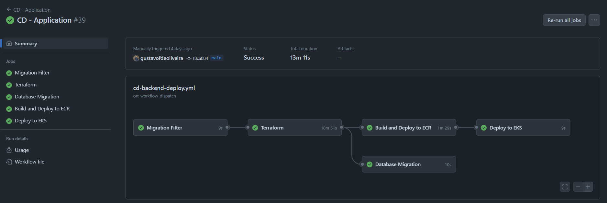

# AWS

A Amazon Web Services (AWS) é uma plataforma de serviços em nuvem que oferece poder computacional, armazenamento de banco de dados, entrega de conteúdo e outras funcionalidades para ajudar as empresas a expandir e crescer. A AWS é uma plataforma de computação em nuvem segura, flexível e escalável.

## Vantagens

- **Escalabilidade**: A AWS oferece a capacidade de aumentar ou diminuir a capacidade de computação em minutos, não horas ou dias. Isso significa que você pode escalar para cima conforme a demanda aumenta ou para baixo conforme a demanda diminui.
- **Elasticidade**: A AWS permite que você use a quantidade de recursos necessária para atender às suas necessidades em um determinado momento. Isso significa que você pode aumentar ou diminuir a capacidade de computação conforme necessário, sem ter que pagar por recursos que não está usando.
- **Segurança**: A AWS oferece uma ampla gama de recursos de segurança para proteger seus dados e aplicativos. Isso inclui criptografia de dados em repouso e em trânsito, autenticação de dois fatores, monitoramento de segurança em tempo real e muito mais.
- **Confiabilidade**: A AWS oferece uma infraestrutura global altamente disponível e confiável. Isso significa que você pode contar com a AWS para manter seus aplicativos em execução 24 horas por dia, 7 dias por semana, sem tempo de inatividade.
- **Flexibilidade**: A AWS oferece uma ampla gama de serviços e recursos para atender às necessidades de qualquer tipo de aplicativo. Isso significa que você pode escolher os serviços que melhor atendem às suas necessidades e personalizar sua infraestrutura de acordo com suas necessidades específicas.
- **Economia de custos**: A AWS oferece uma estrutura de preços flexível que permite pagar apenas pelos recursos que você usa. Isso significa que você pode reduzir os custos operacionais e de capital, eliminando a necessidade de investir em hardware e software caros.
- **Inovação**: A AWS está constantemente inovando e lançando novos serviços e recursos para ajudar as empresas a expandir e crescer. Isso significa que você pode aproveitar as últimas tecnologias e tendências do setor para manter sua empresa competitiva.

## Serviços Utilizados

- **Amazon VPC**: Amazon Virtual Private Cloud (Amazon VPC) é um serviço da web que permite criar uma rede virtual isolada na nuvem da AWS. Ele fornece controle total sobre sua rede virtual, incluindo seleção de seu próprio intervalo de endereços IP, criação de sub-redes e configuração de tabelas de roteamento e gateways de rede.
- **Amazon EC2**: Amazon Elastic Compute Cloud (Amazon EC2) é um serviço da web que fornece capacidade de computação segura e redimensionável na nuvem. Ele foi projetado para facilitar a computação em nuvem na escala da web para desenvolvedores.
- **Amazon S3**: Amazon Simple Storage Service (Amazon S3) é um serviço de armazenamento de objetos que oferece escalabilidade, disponibilidade de dados, segurança e desempenho líderes do setor. Ele foi projetado para armazenar e recuperar qualquer quantidade de dados de qualquer local na web.
- **Amazon RDS**: Amazon Relational Database Service (Amazon RDS) é um serviço de banco de dados relacional que facilita a configuração, operação e escalabilidade de um banco de dados relacional na nuvem. Ele oferece suporte a vários mecanismos de banco de dados, incluindo MySQL, PostgreSQL, Oracle e SQL Server.
- **Amazon EKS**: Amazon Elastic Kubernetes Service (Amazon EKS) é um serviço da web que facilita a execução de aplicativos em contêineres na nuvem da AWS. Ele oferece suporte a Kubernetes, um sistema de código aberto para automatizar a implantação, o dimensionamento e a operação de aplicativos em contêineres.
- **Amazon ECR**: Amazon Elastic Container Registry (Amazon ECR) é um serviço da web que facilita o armazenamento, a implantação e a execução de imagens de contêiner na nuvem da AWS. Ele oferece suporte a Docker, um sistema de código aberto para automatizar a implantação de aplicativos em contêineres.
- **Amazon CloudWatch**: Amazon CloudWatch é um serviço de monitoramento e observabilidade que fornece dados e insights sobre a integridade e o desempenho de seus aplicativos e recursos na nuvem da AWS. Ele oferece suporte a métricas, logs, eventos e alarmes para ajudar a monitorar e solucionar problemas em tempo real.
- **Amazon ElastiCache**: Amazon ElastiCache é um serviço de cache na memória que facilita a implantação, a operação e o dimensionamento de caches na nuvem da AWS. Ele oferece suporte a Redis e Memcached, dois mecanismos de cache de código aberto amplamente utilizados na indústria.


## Terraform (IAC)

O Terraform é uma ferramenta de código aberto desenvolvida pela HashiCorp que permite criar, alterar e versionar infraestrutura de forma segura e eficiente. Ele possibilita definir a infraestrutura como código (IAC) utilizando uma linguagem de configuração simples e declarativa chamada HashiCorp Configuration Language (HCL) ou JSON.

O Terraform é uma ferramenta poderosa que automatiza a criação e o gerenciamento de recursos de infraestrutura na nuvem da AWS. Além da AWS, ele oferece suporte a vários provedores de nuvem, como Azure, Google Cloud Platform, entre outros. Com o Terraform, é possível definir a infraestrutura como código, permitindo versionar, revisar e colaborar nela da mesma forma que se faz com o código de aplicativo. Isso facilita a manutenção, a escalabilidade e a consistência dos ambientes de infraestrutura.

### Estrutura de Diretórios

A estrutura de diretórios do Terraform é organizada de acordo com as melhores práticas recomendadas pela comunidade. Para cada ambiente (local, desenvolvimento, homologação, produção), é criado um diretório separado contendo os arquivos de configuração do Terraform. Cada diretório contém os seguintes arquivos:

````terraform

deploy/
├── charts-aws/
├── charts-local/
└── iac/
    ├── .terraform/
    │   └── .terraform.lock.hcl
    ├── ecr.tf
    ├── eks.tf
    ├── main.tf
    ├── network.tf
    ├── rds.tf
    ├── redis.tf
    ├── sg.tf
    ├── variables.tf
    └── vpc.tf

````

- **charts-aws/**: Diretório contendo os arquivos de configuração do Helm para implantar os serviços na AWS.
- **charts-local/**: Diretório contendo os arquivos de configuração do Helm para implantar os serviços localmente.
- **iac/**: Diretório contendo os arquivos de configuração do Terraform para criar a infraestrutura na AWS.
  - **.terraform/**: Diretório contendo os arquivos de estado do Terraform.
  - **ecr.tf**: Arquivo de configuração do Terraform para criar o Amazon Elastic Container Registry (ECR).
  - **eks.tf**: Arquivo de configuração do Terraform para criar o Amazon Elastic Kubernetes Service (EKS).
  - **main.tf**: Arquivo de configuração do Terraform para configurar o provedor da AWS.
  - **network.tf**: Arquivo de configuração do Terraform para criar a rede virtual na AWS.
  - **rds.tf**: Arquivo de configuração do Terraform para criar o Amazon Relational Database Service (RDS).
  - **redis.tf**: Arquivo de configuração do Terraform para criar o Amazon ElastiCache (Redis).
  - **sg.tf**: Arquivo de configuração do Terraform para criar os grupos de segurança na AWS.
  - **variables.tf**: Arquivo de configuração do Terraform para definir as variáveis de ambiente.
  - **vpc.tf**: Arquivo de configuração do Terraform para criar a Amazon Virtual Private Cloud (VPC).


### Comandos do Terraform

A seguir, estão listados os principais comandos do Terraform para criar, alterar e destruir a infraestrutura na AWS e que são utilizados na pipeline de CI/CD:

- **terraform init**: Inicializa o diretório de trabalho do Terraform e baixa os plugins necessários.
  
  ````bash
  terraform init
  ````

- **terraform plan**: Gera um plano de execução que mostra as alterações que serão feitas na infraestrutura.

  ````bash
    terraform plan
    ````
- **terraform apply**: Aplica as alterações descritas no plano de execução.

  ````bash
  terraform apply
  ````

- **terraform destroy**: Destrói a infraestrutura criada.

  ````bash
    terraform destroy
    ````

## Pipeline de CI/CD

A pipeline de CI/CD é um processo automatizado que permite integrar, testar e implantar alterações de código de forma contínua e eficiente. Ela é composta por várias etapas, como build, testes, deploy, monitoramento e rollback, que são executadas de forma sequencial ou paralela, conforme necessário. A pipeline de CI/CD é essencial para garantir a qualidade, a segurança e a estabilidade do código em produção.

Para o projeto, os seguintes estágios foram definidos na pipeline de CI/CD:

- **Changes**: Verifica se houve alterações na pasta de dados.
- **Terraform**: Inicializa, planeja e aplica as alterações na infraestrutura da AWS.
- **Migration**: Executa as migrações do banco de dados e popula os dados iniciais.
- **Build e Push**: Compila o código-fonte em images Docker e gera os artefatos da aplicação, posteriormente, faz o push das imagens para o Amazon Elastic Container Registry (ECR).
- **Kubernetes**: Implanta as imagens Docker no Amazon Elastic Kubernetes Service (EKS).

### Estrutura da Pipeline

Abaixo é apresentada a estrutura da pipeline de CI/CD, que foi implementada utilizando o Github Actions CI/CD:



### Código da Pipeline

O código da pipeline de CI/CD é definido no arquivo `.github/workflows/cd-backend-deploy.yml` e está organizado da seguinte forma:

- **Configurações**: Define o nome da pipeline, o evento de disparo e o ambiente de execução.
````yaml
name: "CD - Application"

on:
  workflow_dispatch:

permissions:
  contents: read

env:
  AWS_ACCESS_KEY_ID: ${{ secrets.AWS_ACCESS_KEY_ID }}
  AWS_SECRET_ACCESS_KEY: ${{ secrets.AWS_SECRET_ACCESS_KEY }}
  AWS_SESSION_TOKEN: ${{ secrets.AWS_SESSION_TOKEN }}
  AWS_REGION: ${{ secrets.AWS_REGION }}
  BUCKET_TERRAFORM_STATE: ${{ secrets.BUCKET_TERRAFORM_STATE }}

````

- **Job de Changes**: Verifica se houve alterações na pasta de dados. 
````yaml
changes:
    name: "Migration Filter"
    runs-on: ubuntu-latest
    outputs:
      database: ${{ steps.filter.outputs.database }}

    steps:
      - name: Checkout code
        uses: actions/checkout@v2

      - name: Paths filter
        id: filter
        uses: dorny/paths-filter@v2
        with:
          base: ${{ github.ref }}
          filters: |
            database:
              - 'database/**'
````

- **Job de Terraform**: Inicializa, planeja e aplica as alterações na infraestrutura da AWS.
````yaml
terraform:
    name: "Terraform"
    needs: changes
    runs-on: ubuntu-latest

    defaults:
      run:
        shell: bash

    steps:
      - name: Checkout
        uses: actions/checkout@v4

      - name: Setup AWS Credentials
        uses: aws-actions/configure-aws-credentials@v4
        with:
          aws-access-key-id: ${{ env.AWS_ACCESS_KEY_ID }}
          aws-secret-access-key: ${{ env.AWS_SECRET_ACCESS_KEY }}
          aws-session-token: ${{ env.AWS_SESSION_TOKEN }}
          aws-region: ${{ env.AWS_REGION }}

      - name: Download Terraform State files from S3
        working-directory: deploy/iac/
        run: |
          aws s3 cp s3://${{env.BUCKET_TERRAFORM_STATE}}/state-files/terraform.tfstate terraform.tfstate
          aws s3 cp s3://${{env.BUCKET_TERRAFORM_STATE}}/state-files/terraform.tfstate.backup terraform.tfstate.backup
        continue-on-error: true

      - name: Setup Terraform
        uses: hashicorp/setup-terraform@v3

      - name: Terraform Init
        working-directory: deploy/iac/
        run: terraform init

      - name: Terraform Format
        working-directory: deploy/iac/
        run: terraform fmt

      - name: Terraform Validate
        working-directory: deploy/iac/
        run: terraform validate

      - name: Check for Changes in 'infrastructure' folder
        run: |
          if git diff --name-only ${{ github.event.before }} ${{ github.sha }} | grep -q '^deploy/iac/'; then
            echo "Alterações encontradas na pasta 'infrastructure'. Executando Terraform Plan."
          else
            echo "Nenhuma alteração na pasta 'infrastructure'. Ignorando o Terraform Plan."
            exit 0  # Encerra o fluxo de trabalho sem erro
          fi

      - name: Terraform Plan e Terraform Apply
        working-directory: deploy/iac/
        run: terraform plan -input=false -out=tfplan && terraform apply -auto-approve -input=false tfplan
        continue-on-error: true

      - name: Upload Terraform State files to S3
        working-directory: deploy/iac/
        run: |
          aws s3 cp terraform.tfstate s3://${{env.BUCKET_TERRAFORM_STATE}}/state-files/terraform.tfstate
          aws s3 cp terraform.tfstate.backup s3://${{env.BUCKET_TERRAFORM_STATE}}/state-files/terraform.tfstate.backup

````

- **Job de Migration**: Executa as migrações do banco de dados e popula os dados iniciais.
````yaml
migration:
    name: "Database Migration"
    needs: [changes, terraform]

    if: ${{ needs.changes.outputs.database == 'true' }}
    runs-on: ubuntu-latest

    defaults:
      run:
        shell: bash

    steps:
      - name: Check out code
        uses: actions/checkout@v4

      - name: Setup AWS Credentials
        uses: aws-actions/configure-aws-credentials@v4
        with:
          aws-access-key-id: ${{ env.AWS_ACCESS_KEY_ID }}
          aws-secret-access-key: ${{ env.AWS_SECRET_ACCESS_KEY }}
          aws-session-token: ${{ env.AWS_SESSION_TOKEN }}
          aws-region: ${{ env.AWS_REGION }}

      - name: Get RDS endpoint
        id: rds_endpoint
        run: |
          DB_INSTANCE_IDENTIFIER=prod-db
          DB_ENDPOINT=$(aws rds describe-db-instances --db-instance-identifier $DB_INSTANCE_IDENTIFIER --query "DBInstances[0].Endpoint.Address" --output text)
          echo "::set-output name=endpoint::$DB_ENDPOINT"

      - name: Install PostgreSQL client
        run: sudo apt-get install -y postgresql-client

      - name: Execute SQL script - Migration
        working-directory: ./database/
        env:
          DB_ENDPOINT: ${{ steps.rds_endpoint.outputs.endpoint }}
          DB_NAME: prod
          MASTER_USERNAME: postgres
          MASTER_USER_PASSWORD: postgres123
        run: |
          psql postgresql://$MASTER_USERNAME:$MASTER_USER_PASSWORD@$DB_ENDPOINT:5432/$DB_NAME -f 1-tables.sql

      - name: Execute SQL script - Data
        working-directory: ./database/
        env:
          DB_ENDPOINT: ${{ steps.rds_endpoint.outputs.endpoint }}
          DB_NAME: prod
          MASTER_USERNAME: postgres
          MASTER_USER_PASSWORD: postgres123
        run: |
          psql postgresql://$MASTER_USERNAME:$MASTER_USER_PASSWORD@$DB_ENDPOINT:5432/$DB_NAME -f 2-data.sql

````

- **Job de Build e Push**: Compila o código-fonte em images Docker e gera os artefatos da aplicação, posteriormente, faz o push das imagens para o Amazon Elastic Container Registry (ECR).
````yaml
build:
    name: "Build and Deploy to ECR"
    needs: terraform
    runs-on: ubuntu-latest

    defaults:
      run:
        shell: bash

    steps:
      - name: Check out code
        uses: actions/checkout@v4

      - name: Setup AWS Credentials
        uses: aws-actions/configure-aws-credentials@v4
        with:
          aws-access-key-id: ${{ env.AWS_ACCESS_KEY_ID }}
          aws-secret-access-key: ${{ env.AWS_SECRET_ACCESS_KEY }}
          aws-session-token: ${{ env.AWS_SESSION_TOKEN }}
          aws-region: ${{ env.AWS_REGION }}

      - name: Login to Amazon ECR
        id: login-ecr
        uses: aws-actions/amazon-ecr-login@v1

      - name: Setup .ENV
        working-directory: ./backend/
        run: make env

      - name: Build Conductor Monolith
        working-directory: ./backend/
        env:
          ECR_REGISTRY: ${{ steps.login-ecr.outputs.registry }}
          ECR_REPOSITORY: conductor
          IMAGE_TAG: latest
        run: |
          docker buildx build -t $ECR_REGISTRY/$ECR_REPOSITORY:$IMAGE_TAG --push -f ./build/Dockerfile.conductor .

      - name: Build Backend Monolith
        working-directory: ./backend/
        env:
          ECR_REGISTRY: ${{ steps.login-ecr.outputs.registry }}
          ECR_REPOSITORY: server
          IMAGE_TAG: latest
        run: |
          docker buildx build -t $ECR_REGISTRY/$ECR_REPOSITORY:$IMAGE_TAG --push -f ./build/Dockerfile.server .

````

- **Job de Kubernetes**: Implanta as imagens Docker no Amazon Elastic Kubernetes Service (EKS).
````yaml
kubernetes:
    name: "Deploy to EKS"
    needs: [terraform, build]
    runs-on: ubuntu-latest

    defaults:
      run:
        shell: bash

    steps:
      - name: Check out code
        uses: actions/checkout@v4

      - name: Setup AWS Credentials
        uses: aws-actions/configure-aws-credentials@v4
        with:
          aws-access-key-id: ${{ env.AWS_ACCESS_KEY_ID }}
          aws-secret-access-key: ${{ env.AWS_SECRET_ACCESS_KEY }}
          aws-session-token: ${{ env.AWS_SESSION_TOKEN }}
          aws-region: ${{ env.AWS_REGION }}

      - name: Login to Amazon ECR
        id: login-ecr
        uses: aws-actions/amazon-ecr-login@v1

      - name: Check if EKS cluster exists
        id: check-cluster
        run: |
          aws eks describe-cluster --name eks-prod --region ${{ env.AWS_REGION }} || echo "Cluster does not exist"

      - name: Update kubeconfig
        run: aws eks --region ${{ env.AWS_REGION }} update-kubeconfig --name eks-prod

      - name: Deploy to EKS - Server
        working-directory: deploy/charts-aws/
        run: |
          helm upgrade --install server server/ \
          --namespace server \
          --values server/values.yaml

      - name: Deploy to EKS - Conductor
        working-directory: deploy/charts-aws/
        run: |
          helm upgrade --install conductor conductor/ \
          --namespace conductor \
          --values conductor/values.yaml

````


### Limitações do Github Actions

Aqui está a versão corrigida e melhorada do texto:

O GitHub Actions é uma ferramenta poderosa para automatizar o processo de CI/CD, mas possui algumas limitações que devem ser consideradas. O padrão de mercado recomenda a divisão de responsabilidades, onde a pipeline de CI/CD é separada em diferentes estágios, cada um com sua própria responsabilidade. No entanto, o GitHub Actions não oferece suporte nativo para essa abordagem, o que pode dificultar a implementação de pipelines complexas. Isso ocorre porque o GitHub Actions limpa o ambiente de execução após a conclusão de cada job, o que impede a comunicação entre os jobs e a passagem de dados entre eles. Outros pontos negativos em relação ao GitHub Actions são:

- **Limitação de tempo de execução**: O GitHub Actions possui um limite de tempo de execução de 6 horas para cada job, o que pode ser insuficiente para pipelines complexas que envolvem várias etapas e dependências.
- **Limitação de armazenamento**: O GitHub Actions possui um limite de armazenamento de 2 GB para cada repositório, o que pode ser insuficiente para armazenar artefatos de build e imagens Docker.
- **Limitação de execução paralela**: O GitHub Actions possui um limite de execução paralela de 20 jobs por repositório, o que pode ser insuficiente para pipelines que envolvem vários estágios e dependências.
- **Limitação de escalabilidade**: O GitHub Actions possui um limite de escalabilidade de 100 jobs por execução, o que pode ser insuficiente para pipelines que envolvem vários repositórios e dependências.


## Conclusão

Durante a Sprint 4, o grupo conseguiu configurar a infraestrutura na AWS utilizando o Terraform e implementar a pipeline de CI/CD utilizando o GitHub Actions. A infraestrutura foi criada de forma automatizada e escalável, o que facilitou a implantação e o gerenciamento dos recursos na nuvem. A pipeline de CI/CD permitiu integrar, testar e implantar as alterações de código de forma contínua e eficiente, garantindo a qualidade, a segurança e a estabilidade do código em produção. No entanto, o GitHub Actions possui algumas limitações que devem ser consideradas ao implementar pipelines complexas. Apesar disso, a equipe conseguiu superar os desafios e entregar os objetivos propostos para a Sprint 4.

