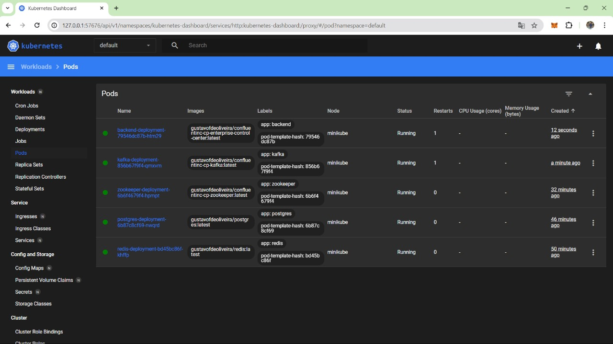

# Kubernetes

O Kubernetes é uma plataforma de código aberto que automatiza a implantação, o dimensionamento e a operação de aplicativos em contêineres. Ele foi projetado para lidar com a escalabilidade e a disponibilidade de aplicativos, permitindo que os desenvolvedores se concentrem em escrever código sem se preocupar com a infraestrutura subjacente.

## Vantages do Kubernetes

O Kubernetes oferece várias vantagens para o desenvolvimento e a operação de aplicativos em contêineres:

- **Escalabilidade:** O Kubernetes permite escalar aplicativos de forma rápida e eficiente, garantindo que os recursos necessários estejam disponíveis para atender à demanda.
- **Disponibilidade:** O Kubernetes garante que os aplicativos estejam sempre disponíveis, mesmo em caso de falhas de hardware ou software.
- **Automação:** O Kubernetes automatiza tarefas operacionais, como implantação, dimensionamento e monitoramento de aplicativos, permitindo que os desenvolvedores se concentrem em escrever código.
- **Portabilidade:** O Kubernetes é uma plataforma agnóstica em relação à infraestrutura, o que significa que os aplicativos podem ser executados em qualquer ambiente de nuvem ou local que suporte contêineres.
- **Segurança:** O Kubernetes oferece recursos avançados de segurança, como isolamento de contêineres, autenticação e autorização, para proteger os aplicativos e os dados.

## Arquitetura do Kubernetes

O Kubernetes é composto por vários componentes que trabalham juntos para fornecer uma plataforma de orquestração de contêineres. Alguns dos principais componentes do Kubernetes incluem:

- **Master Node:** O nó mestre é responsável por coordenar as operações do cluster, como a programação de contêineres e a distribuição de recursos.
- **Worker Node:** Os nós de trabalho são responsáveis por executar os contêineres e fornecer os recursos necessários para sua execução.
- **Pods:** Os pods são a unidade básica de implantação no Kubernetes e podem conter um ou mais contêineres.
- **Services:** Os serviços são responsáveis por expor os contêineres para comunicação com outros aplicativos dentro e fora do cluster.
- **Volumes:** Os volumes são usados para armazenar dados persistentes usados pelos contêineres.
- **Namespaces:** Os namespaces são usados para organizar e isolar recursos dentro do cluster.
- **Labels:** Os rótulos são usados para identificar e agrupar recursos dentro do cluster.
- **Selectors:** Os seletores são usados para selecionar recursos com base em rótulos específicos.

## Minikube

O Minikube é uma ferramenta que permite executar um cluster Kubernetes localmente em uma máquina virtual. Ele é útil para desenvolvedores que desejam testar aplicativos em um ambiente Kubernetes sem a necessidade de provisionar recursos em um ambiente de nuvem. Para saber mais sobre o Minikube, consulte a [documentação oficial](https://minikube.sigs.k8s.io/docs/).

### Vantages do Minikube

O Minikube oferece várias vantagens para o desenvolvimento e teste de aplicativos em Kubernetes:

- **Facilidade de uso:** O Minikube é fácil de instalar e configurar, permitindo que os desenvolvedores criem um cluster Kubernetes local em questão de minutos.
- **Portabilidade:** O Minikube pode ser executado em qualquer máquina que suporte máquinas virtuais, tornando-o ideal para desenvolvedores que trabalham em diferentes ambientes.
- **Isolamento:** O Minikube cria um ambiente Kubernetes isolado em uma máquina virtual, garantindo que os aplicativos em desenvolvimento não interfiram em outros aplicativos ou serviços.
- **Compatibilidade:** O Minikube é compatível com várias plataformas, incluindo Windows, macOS e Linux, permitindo que os desenvolvedores escolham a plataforma que melhor se adapta às suas necessidades.

### Motivação

O Kubernetes é uma plataforma poderosa para orquestração de contêineres, mas pode ser complexo de configurar e gerenciar. O Minikube simplifica o processo de criação de um cluster Kubernetes local, permitindo que os desenvolvedores testem aplicativos em um ambiente Kubernetes sem a necessidade de provisionar recursos na nuvem. Além disso, como o grupo ainda está na fase de desenvolvimento e testes, o Minikube se torna uma ferramenta ideal para essa etapa, facilitando o desenvolvimento e teste de aplicativos em Kubernetes.

## Deploy de Aplicações no Kubernetes

O Kubernetes oferece várias maneiras de implantar aplicativos em um cluster, incluindo a criação de manifestos YAML, a utilização de Helm Charts e a integração com ferramentas de CI/CD. Cada método tem suas próprias vantagens e desvantagens, e a escolha do método certo depende das necessidades específicas do projeto.

## Implementação da Sprint 3

O grupo optou por enquanto por realizar a configuração base de deploy no Kubernetes, para isso foi criado um arquivo de configuração `<serviço>-deployment.yaml` que contém as informações necessárias para implantar a aplicação no cluster Kubernetes. Abaixo está o arquivo de configuração `deployment.yaml` utilizado para implantar a aplicação no Kubernetes.


### Arquivos de Configuração

Abaixo estão os arquivos de configuração utilizados para implantar os serviços no Kubernetes:

#### redis-deployment.yaml

```yaml
apiVersion: apps/v1
kind: Deployment
metadata:
  name: redis-deployment
  labels:
    app: redis
spec:
  replicas: 1
  selector:
    matchLabels:
      app: redis
  template:
    metadata:
      labels:
        app: redis
    spec:
      containers:
      - name: redis
        image: gustavofdeoliveira/redis:latest
        ports:
        - containerPort: 5432
```

#### postgres-deployment.yaml

```yaml
apiVersion: apps/v1
kind: Deployment
metadata:
  name: postgres-deployment
  labels:
    app: postgres
spec:
  replicas: 1
  selector:
    matchLabels:
      app: postgres
  template:
    metadata:
      labels:
        app: postgres
    spec:
      containers:
      - name: postgres
        image: gustavofdeoliveira/postgres:latest
        ports:
        - containerPort: 5432
        env:
        - name: POSTGRES_USER
          value: "user"
        - name: POSTGRES_PASSWORD
          value: "password"
        - name: POSTGRES_DB
          value: "db"
```

#### zookeeper-deployment.yaml

```yaml
apiVersion: apps/v1
kind: Deployment
metadata:
  name: zookeeper-deployment
  labels:
    app: zookeeper
spec:
  replicas: 1
  selector:
    matchLabels:
      app: zookeeper
  template:
    metadata:
      labels:
        app: zookeeper
    spec:
      containers:
        - name: zookeeper
          image: gustavofdeoliveira/confluentinc-cp-zookeeper:latest
          ports:
            - containerPort: 2181
            - containerPort: 2000
          env:
            - name: ZOOKEEPER_CLIENT_PORT
              value: "2181"
            - name: ZOOKEEPER_TICK_TIME
              value: "2000"
           
```
#### kafka-deployment.yaml

```yaml
apiVersion: apps/v1
kind: Deployment
metadata:
  name: kafka-deployment
  labels:
    app: kafka
spec:
  replicas: 1
  selector:
    matchLabels:
      app: kafka
  template:
    metadata:
      labels:
        app: kafka
    spec:
      containers:
        - name: kafka
          image: gustavofdeoliveira/confluentinc-cp-kafka:latest
          ports:
            - containerPort: 9092
            - containerPort: 9094
          env:
            - name: KAFKA_BROKER_ID
              value: "1"
            - name: KAFKA_OFFSETS_TOPIC_REPLICATION_FACTOR
              value: "1"
            - name: KAFKA_ZOOKEEPER_CONNECT
              value: "zookeeper:2181"
            - name: KAFKA_INTER_BROKER_LISTENER_NAME
              value: INTERNAL
            - name: KAFKA_LISTENERS
              value: INTERNAL://:9092,OUTSIDE://:9094
            - name: KAFKA_ADVERTISED_LISTENERS
              value: INTERNAL://kafka:9092,OUTSIDE://host.docker.internal:9094
            - name: KAFKA_LISTENER_SECURITY_PROTOCOL_MAP
              value: INTERNAL:PLAINTEXT,OUTSIDE:PLAINTEXT
            - name: KAFKA_AUTO_CREATE_TOPICS_ENABLE
              value: "true"

```
#### backend-deployment.yaml

```yaml
apiVersion: apps/v1
kind: Deployment
metadata:
  name: backend-deployment
  labels:
    app: backend
spec:
  replicas: 1
  selector:
    matchLabels:
      app: backend
  template:
    metadata:
      labels:
        app: backend
    spec:
      containers:
        - name: backend
          image: gustavofdeoliveira/confluentinc-cp-enterprise-control-center:latest
          ports:
            - containerPort: 9021
          env:
            - name: CONTROL_CENTER_BOOTSTRAP_SERVERS
              value: "kafka:9092"
            - name: CONTROL_CENTER_REPLICATION_FACTOR
              value: "1"
            - name: "PORT"
              value : 9021
           
```

### Deploy e Testes Locais

Para implantar a aplicação no Kubernetes localmente, siga as instruções abaixo:

1. Instale o Minikube seguindo as instruções da [documentação oficial](https://minikube.sigs.k8s.io/docs/start/).
2. Inicie o cluster Minikube executando o comando `minikube start`.
3. Acesse o dashboard do Kubernetes executando o comando `minikube dashboard`.
4. Abra um novo terminal e navegue até o diretório onde o arquivo de configuração `deployment.yaml` está localizado.
5. Aplique o arquivo de configuração `deployment.yaml` executando o comando `kubectl apply -f deployment.yaml`.
6. Verifique se o serviço foi implantado corretamente executando o comando `kubectl get pods`.

Dessa forma, no dashboard do Kubernetes é possível visualizar os serviços implantados no cluster, bem como os pods, deployments e outros recursos do Kubernetes:

#### Workloads

No workloads é possível visualizar os deployments, replica sets e stateful sets dos serviços implantados no cluster. Abaixo estão os deployments dos serviços `redis`, `postgres`, `zookeeper`, `kafka` e `backend`:


#### Deployments

No deployments é possível visualizar os deployments dos serviços implantados no cluster. Abaixo estão os deployments dos serviços `redis`, `postgres`, `zookeeper`, `kafka` e `backend`:


#### Pods

No pods é possível visualizar os pods dos serviços implantados no cluster. Abaixo estão os pods dos serviços `redis`, `postgres`, `zookeeper`, `kafka` e `backend`:



### Pipeline de Deploy

O processo de deploy envolve o GitHub Actions como agente principal, responsável por realizar o build e o push das imagens para o Docker Hub. O GitHub Actions é um serviço de integração contínua e entrega contínua (CI/CD) que permite automatizar o processo de build, testes e deploy de aplicações. A pipeline de deploy está integrada na pipeline de `CI/CD - Backend`, sendo executada automaticamente após o step de deploy das imagens para o Docker Hub. Dessa forma, serve como um step de teste das imagens recém-criadas, além de testar consequentemente os arquivos `yaml` de deploy no Kubernetes.

Para acessar o arquivo de configuração do pipeline de deploy, clique [aqui](https://github.com/Inteli-College/2024-1B-T02-EC10-G04/actions/workflows/cd-backend.yml).

## Conclusão

Por fim, a configuração base de deploy no Kubernetes foi realizada com sucesso, permitindo a implantação dos serviços `redis`, `postgres`, `zookeeper`, `kafka` e `backend` no cluster Kubernetes local. O processo de deploy foi automatizado por meio do GitHub Actions, garantindo a integridade e a consistência das imagens e dos arquivos de configuração `yaml` utilizados no Kubernetes. Além disso, o Minikube se mostrou uma ferramenta eficaz para o desenvolvimento e teste de aplicativos em Kubernetes, facilitando a criação de um cluster Kubernetes local em questão de minutos. Com isso, o grupo está pronto para avançar para a próxima etapa do desenvolvimento, que envolve a integração dos serviços e a implementação das user stories restantes.