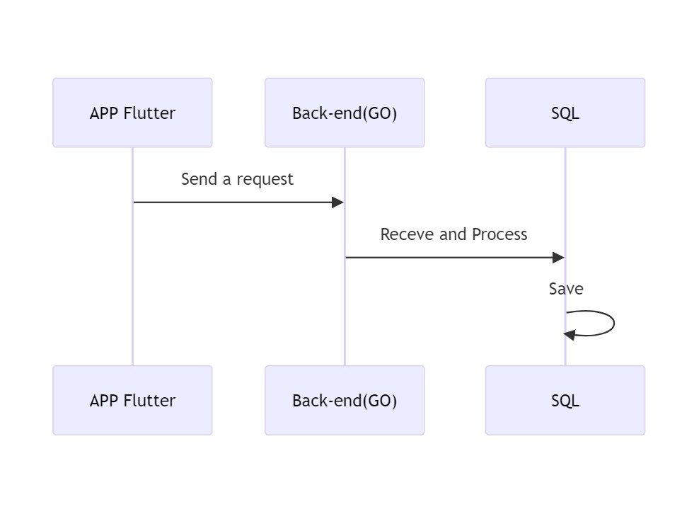
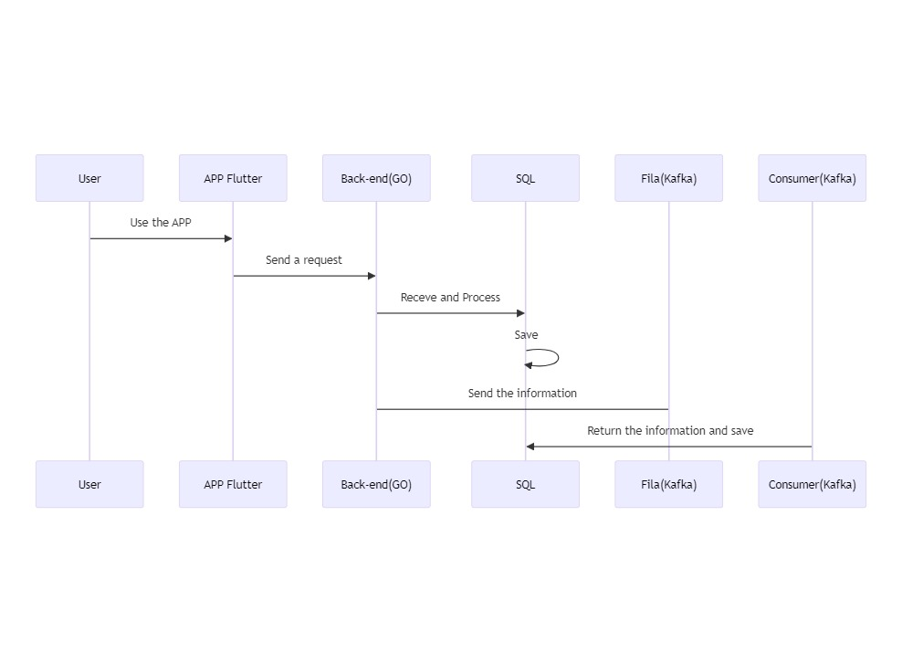

# Arquitetura da Solução

A arquitetura da solução é composta por três camadas: APP Mobile, Backend e Banco de Dados. A comunicação entre as camadas é feita através de requisições HTTP.

## APP Mobile

O aplicativo serve como a interface de acesso à plataforma por meio de dispositivos móveis, permitindo aos colaboradores enviar solicitações de medicamentos de maneira rápida e fácil. Além de autenticar os usuários, ele gerencia o envio de solicitações, exibe o status das solicitações enviadas e, se necessário, coleta os dados necessários para auditorias futuras.

## Backend

O backend é responsável por processar as solicitações provenientes do aplicativo móvel, armazenar os dados no banco de dados e fornecer respostas ao aplicativo. Ele também gerencia a autenticação dos usuários, valida a integridade dos dados enviados e mantém a comunicação contínua com o banco de dados.

## Banco de Dados

O Banco de Dados armazena informações sobre os usuários, solicitações de medicamentos e o status dessas solicitações. Ele é responsável por garantir a integridade dos dados, a consistência das informações e a disponibilidade dos dados para consulta.

## Diagrama da Solução

O diagrama a seguir ilustra a arquitetura da solução proposta.

### Tecnologias dos Componentes

- **APP Mobile:** Para a implementação do aplicativo, será utilizado o framework Flutter, que permite o desenvolvimento de aplicativos nativos para Android e iOS a partir de um único código-fonte.
- **Backend:** O backend será desenvolvido utilizando a linguagem de programação Go, que é conhecida por sua eficiência e desempenho. O framework Gin será utilizado para facilitar o desenvolvimento de APIs RESTful.
- **Banco de Dados:** O banco de dados será implementado utilizando o PostgreSQL, um sistema de gerenciamento de banco de dados relacional de código aberto.
  

## Considerações Futura

Embora a compreensão do problema e a proposta de solução não sejam capazes de sanar completamente a dor do cliente, a solução proposta é um primeiro passo para melhorar o processo de solicitação de medicamentos. Esta solução pode ser expandida e aprimorada ao longo das sprints ou futuramente pelo próprio cliente durante o processo de implementação, com a adição de novos recursos e funcionalidades, tais como:

- **Notificações em Tempo Real:** Implementar um sistema de notificações em tempo real para informar os colaboradores sobre o status de suas solicitações.
- **Auditoria de Solicitações:** Adicionar funcionalidades para permitir a auditoria das solicitações enviadas, incluindo informações sobre quem fez a solicitação, quando foi feita e o status atual da solicitação.
- **Dashboard de Monitoramento:** Desenvolver um dashboard para monitorar o volume de solicitações, o tempo médio de atendimento e outras métricas relevantes para avaliar a eficiência do processo ou realizar auditorias.
- **Integração com Sistemas de Estoque:** Integrar a plataforma com os sistemas de estoque do hospital para garantir que os medicamentos solicitados estejam disponíveis e prontos para serem entregues.
  

### Diagrama da Solução - Notificações em Tempo Real

A seguir, o grupo desenvolveu um diagrama da solução com a adição de notificações em tempo real para facilitar a compreensão da proposta.

