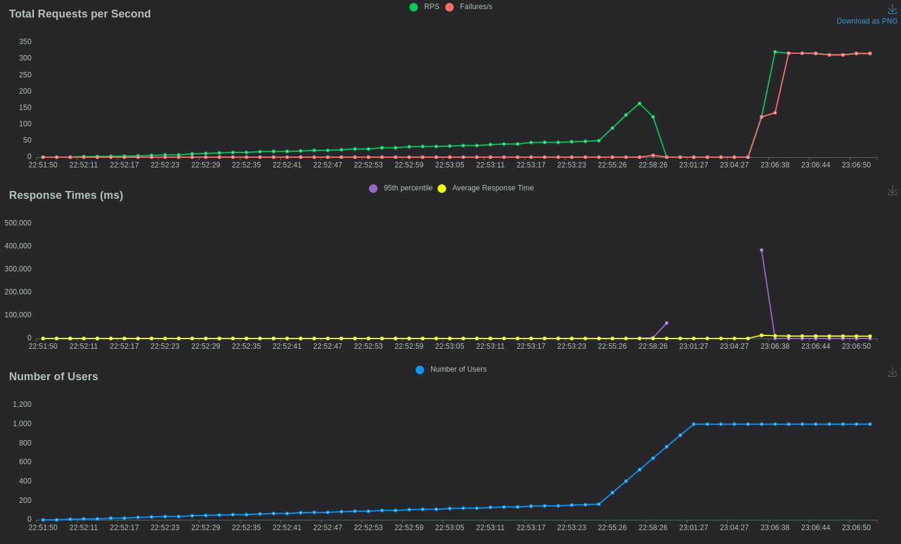
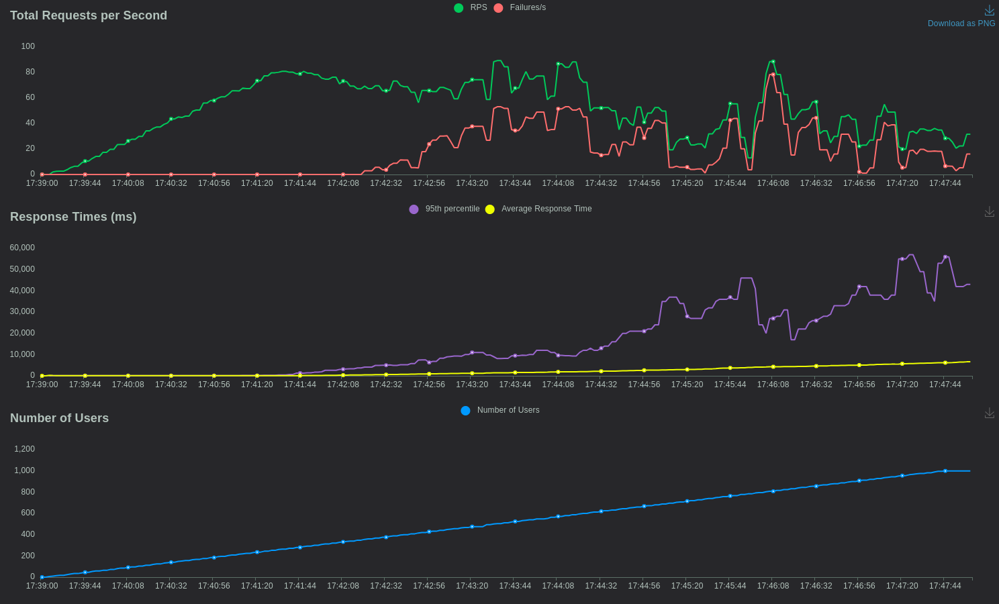
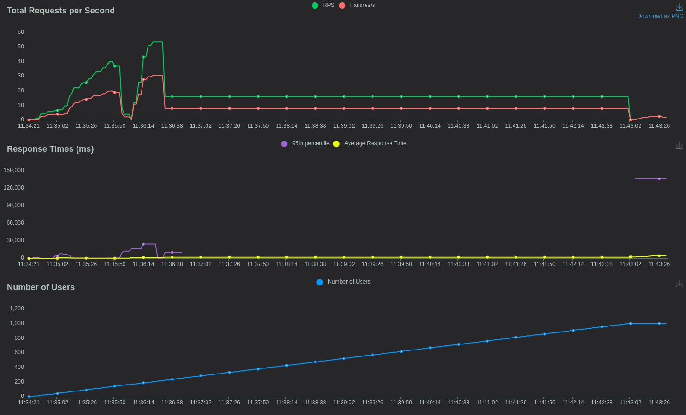

# Testes de Carga

Este documento descreve os testes de carga realizados no backend do nosso projeto durante a Sprint 3. O objetivo dos testes de carga é avaliar a robustez da aplicação e seu comportamento sob um alto volume de requisições. Utilizamos a biblioteca Locust em Python para testar a aplicação backend desenvolvida em Go. Considerando o contexto do Pyxis e da Farmácia Central, com 4000 colaboradores, optamos por utilizar 1000 usuários simulando requisições para verificar se o backend suportava a demanda. Vale ressaltar que os testes foram realizados localmente, pois não seria possível utilizar tal quantidade de usuários se a aplicação já estivesse implantada, devido às limitações do free tier. As entidades abaixo estão listadas em ordem de importância, da mais requisitada para a menos requisitada.

### Teste da entidade Orders

A entidade Orders é responsável pela criação de pedidos. Foi testada com 1000 usuários fazendo requisições simultâneas. Observamos que, à medida que a quantidade de usuários aumentava, a quantidade de falhas também crescia. Uma possível interpretação para esse cenário é a dependência existente para criar uma order, que necessita de um `medicine_id` e um `user_id` válidos, dependentes de outras duas entidades diferentes. Embora essa dependência faça sentido na regra de negócio do backend, ela pode causar uma latência indesejada, indicando a necessidade de uma refatoração futura dessa rota e sua forma de criação.

```shell
{
  "medicine_id": "string",
  "observation": "string",
  "priority": "string",
  "quantity": 0,
  "user_id": "string"
}
```

<p align="center">



</p>

### Teste da entidade Users

A segunda entidade mais importante é a Users, responsável pela criação de usuários no sistema. Esta entidade também foi testada com 1000 usuários fazendo requisições simultâneas. Observamos que houve uma quantidade não tão alta de falhas nas equisições de criação de usuário, demonstrando que a rota foi construída de maneira robusta e com poucas dependências. Contudo, entendemos a necessidade de  realizar mais testes focados em estresse para verificar quantas requisições o sistema suporta.


```shell
{
  "email": "string",
  "name": "string",
  "password": "string",
  "role": "string"
}
```

<p align="center">



</p>

### Teste da entidade Medicines

A terceira entidade em importância é a Medicines, responsável pela criação de medicamentos no sistema. Testamos essa entidade com 1000 usuários fazendo requisições simultâneas. Observamos algumas falhas, que, diferentemente do caso de Orders, não são devidas a dependências de outras entidades. Isso sugere que a rota pode não estar otimizada. Contudo, considerando que essa rota não será muito utilizada, podemos deixar sua otimização para etapas futuras da aplicação.

```shell
{
  "batch": "string",
  "name": "string",
  "stripe": "red"
}
```

<p align="center">



</p>


## Conclusão

Como conclusão, pode-se dizer que o sistema respondeu bem aos testes aos quais foi submetido, demonstrando robustez em todas as suas rotas e entedidades, porém, ainda precisando de certa refatoração para atender às demandas do contexto do hospital.
