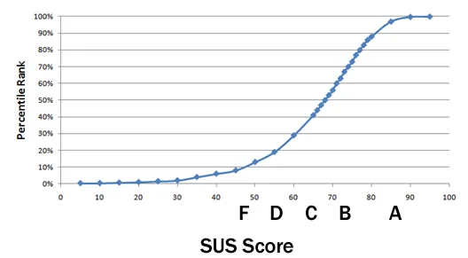

# Testes de Usabilidade

Este documento descreve os resultados do teste de usabilidade conduzido no aplicativo móvel do nosso projeto durante a Sprint 4. O propósito desses testes é avaliar a robustez, intuitividade e a experiência geral do usuário ao utilizar o aplicativo. Utilizamos a Escala de Usabilidade do Sistema (SUS) para avaliar a aplicação mobile desenvolvida em Flutter. 

O teste consistiu em permitir que os usuários interagissem com o MVP de forma autônoma, explorando suas funcionalidades e atribuindo notas numa escala de 0 a 5 ao longo de 10 perguntas, onde as perguntas pares eram negativas e as ímpares positivas. Para calcular a pontuação final, somamos as respostas das perguntas ímpares e subtraímos 5, e somamos e subtraímos 25 para as perguntas pares. Em seguida, multiplicamos a soma das ímpares e pares por 2,5, resultando na pontuação final do teste.

Os critérios avaliados incluíram:

- Efetividade: Os usuários conseguiram completar seus objetivos?
- Eficiência: Quanto esforço e recursos foram necessários para isso?
- Satisfação: A experiência foi satisfatória?

## Resultados dos Testes

O teste foi conduzido com 10 participantes, resultando numa média de 74,5 na escala SUS, o que é bastante positivo, uma vez que a média do System Usability Score é de 68 pontos. Vale ressaltar que o teste abordou apenas o fluxo do usuário requisitante, indicando que a aplicação ainda não está finalizada. Será necessário realizar novos testes quando a aplicação estiver totalmente integrada, a fim de verificar sua consistência e robustez. A média da escala ficou na categoria "bom", conforme as expectativas do grupo.

### Escala de usabilidade SUS

## Conclusão

Em conclusão, os resultados dos testes indicam que o sistema teve um desempenho satisfatório, demonstrando robustez em todas as suas funcionalidades. No entanto, é necessário algum trabalho de refatoração para atender completamente às demandas do contexto hospitalar.