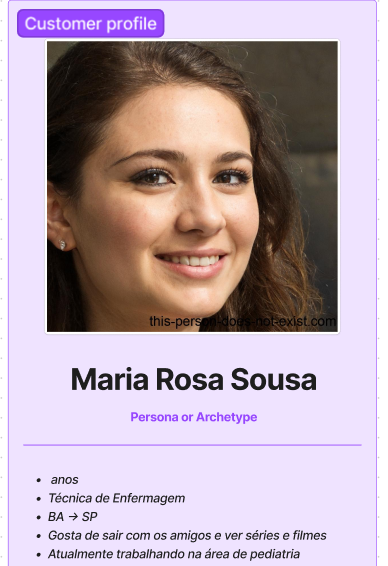

# Personas

Personas são ferramentas usadas em design de experiência do usuário, marketing e desenvolvimento de produtos para representar grupos específicos de usuários finais, clientes ou outras partes interessadas. Elas ajudam as equipes a criar soluções mais eficazes e centradas no usuário, garantindo que os produtos finais sejam úteis e relevantes para o público-alvo. Abaixo, detalhamos três personas desenvolvidas para entender e validar cada etapa do processo de uso de um sistema hospitalar.

## Persona 1: Técnica de Enfermagem - Maria

**Origem:** Bahia  
**Função:** Técnica em enfermagem em um hospital  
**Fluxo de Trabalho:** Usa o sistema para fazer pedidos de medicamentos. Se houver inconsistências, usa o aplicativo para requisitar o necessário para o tratamento dos pacientes.  
**Necessidades:** Praticidade para fazer pedidos urgentes e informações claras sobre o status e localização dos pedidos.  
**Desejos:** Eficiência e padronização no processo de pedidos.  
**Dores:** Falta de informações sobre o status dos pedidos, o que causa ansiedade e perda de tempo.  
**Dificuldades:** Problemas auditivos dificultam a percepção de notificações sonoras. Prefere notificações por vibração ou visualmente destacadas.

## Persona 2: Técnico de Farmácia - Mateus

**Origem:** Belo Horizonte  
**Função:** Técnico de farmácia na farmácia central do hospital  
**Fluxo de Trabalho:** Alterna entre a gestão de pedidos na farmácia e a entrega de medicamentos pelo hospital.  
**Necessidades:** Organização e padronização dos pedidos para facilitar as entregas.  
**Desejos:** Trabalhar de maneira mais dinâmica e eficiente, reduzindo conflitos sobre pedidos e entregas.  
**Dores:** Falta de padronização nos pedidos e ausência de um sistema eficiente para informar os usuários sobre o status dos pedidos.  
**Dificuldades:** Usa óculos, por isso, tem dificuldade com textos pequenos ou interfaces com contraste inadequado.

## Persona 3: Gerente da Farmácia - João

**Origem:** São Paulo
**Experiência:** 8 anos no hospital  
**Função:** Gerente de farmácia, apaixonado por números e análise de dados.  
**Fluxo de Trabalho:** Gerencia e analisa requisições de medicamentos, buscando identificar gargalos e melhorar os processos.  
**Necessidades:** Acesso detalhado às requisições, prioridades e dados analíticos para melhor gestão e implementação de melhorias.  
**Desejos:** Melhorar a qualidade de atendimento através de uma análise eficaz dos dados coletados.  
**Dores:** Dificuldade em identificar gargalos e pontos críticos que afetam a eficiência de sua equipe.  
**Dificuldades:** Devido à idade mais avançada, enfrenta desafios com tecnologias complexas; prefere interfaces intuitivas e simples.

Essas personas ajudam a equipe a manter o foco nas necessidades e desejos específicos dos usuários, garantindo que o desenvolvimento do sistema hospitalar seja orientado para oferecer soluções práticas e eficientes para cada tipo de usuário envolvido.