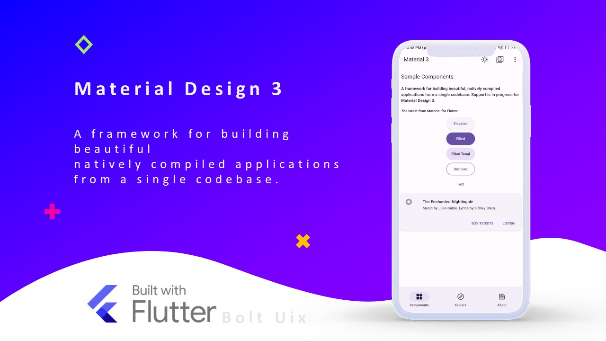
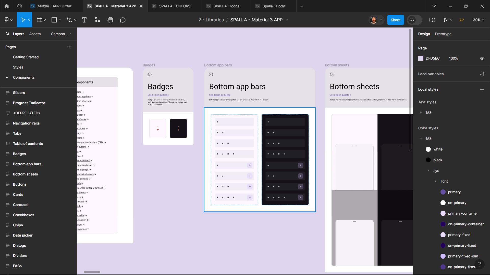
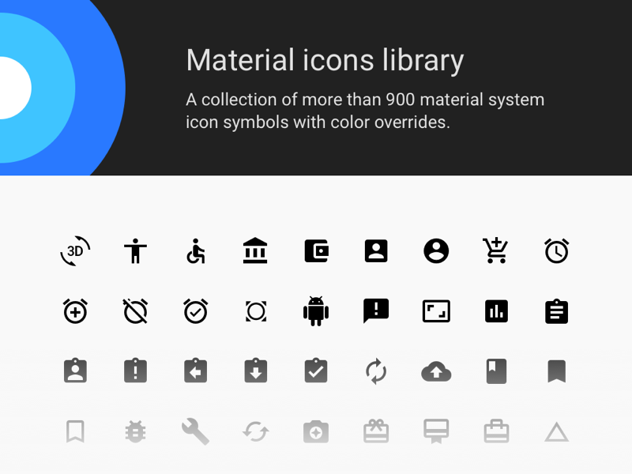
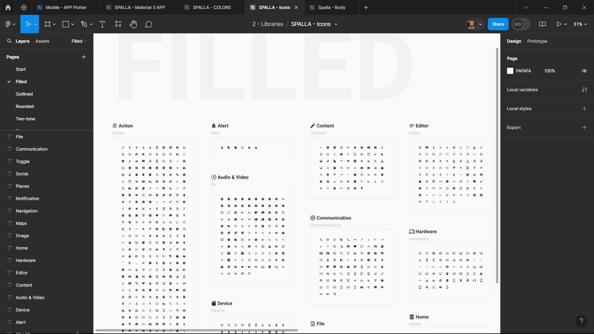
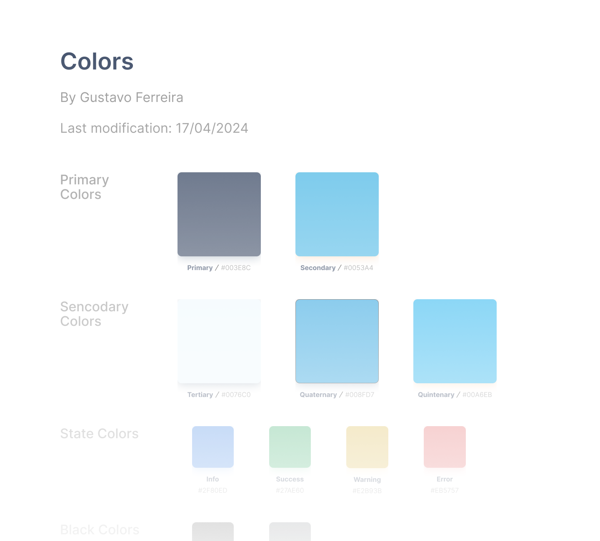
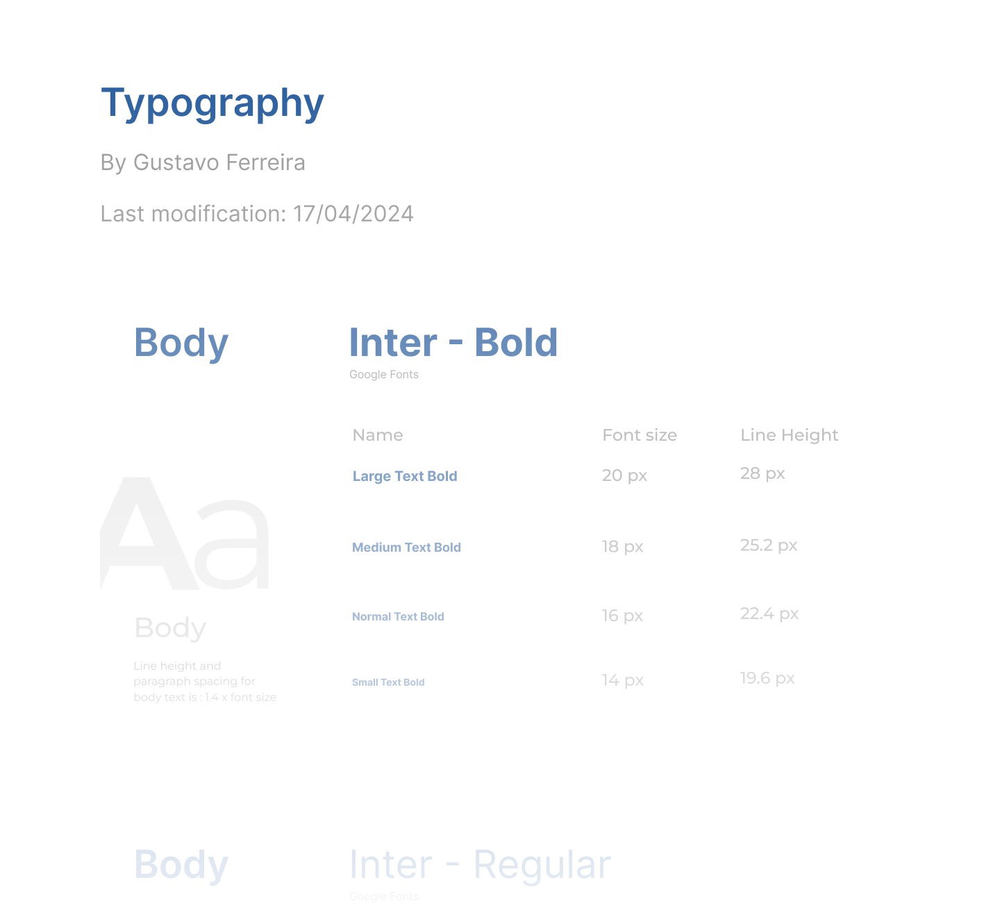

# Spalla 

O Spalla é um Design System desenvolvido para o projeto do Hospital Sírio-Libanês. Ele é composto por uma série de elementos de design, como cores, tipografia, ícones e componentes, que ajudam a garantir a consistência e a coesão visual em todas as interfaces do projeto. O Spalla foi criado com base nos princípios do Material Design, um sistema de design desenvolvido pelo Google, que visa criar interfaces intuitivas e funcionais.

## Princípios de Design

O Spalla é baseado em alguns princípios de design fundamentais que orientam a criação de interfaces eficazes e agradáveis. Alguns desses princípios incluem:

- **Materialidade**: Utilização de sombras e profundidade para criar a ilusão de objetos físicos.
- **Movimento**: Adição de animações e transições para guiar o usuário e fornecer feedback.
- **Hierarquia Visual**: Organização clara e lógica dos elementos para facilitar a compreensão e a navegação.
- **Consistência**: Manutenção de um estilo visual uniforme em todas as interfaces para garantir uma experiência coesa.
- **Acessibilidade**: Garantia de que as interfaces sejam acessíveis a todos os usuários, independentemente de suas necessidades.
- **Responsividade**: Adaptação das interfaces a diferentes dispositivos e tamanhos de tela para uma experiência consistente.

## Elementos do Spalla

O Spalla é composto por vários elementos de design que se combinam para criar uma experiência visual coesa e atraente. Assim, como o violino, o Spalla é composto por várias partes que, juntas, formam um instrumento harmonioso e eficaz. Alguns dos principais elementos do Spalla incluem:

### Material 3 - Spalla UI Kit

Material 3 é a mais recente evolução do Material Design, um sistema de design desenvolvido pelo Google. Este sistema foi concebido para auxiliar os desenvolvedores a criar interfaces que sejam não apenas esteticamente agradáveis, mas também funcionais. Ele se baseia em princípios de design como materialidade, movimento e hierarquia visual. O Material Design incorpora uma variedade de elementos, tais como botões, cards, listas e tipografias, que facilitam a criação de interfaces consistentes e coesas.

No figma, o Spalla UI Kit é um conjunto de componentes de design prontos para uso, que seguem as diretrizes do Spalla Design System. Ele inclui uma variedade de elementos, como botões, cards, formulários e ícones, que podem ser facilmente personalizados e integrados em interfaces de usuário. O Spalla UI Kit é uma ferramenta essencial para designers e desenvolvedores que desejam criar interfaces consistentes e atraentes.
- **Biblioteca de Componentes**: Repositório digital onde os componentes estão disponíveis para o uso.

*NOTA: Todos os componentes possui estados de interação, como hover, focus e active, para garantir uma experiência de usuário consistente e intuitiva.*

### Material Icons

Material Icons é uma coleção de ícones desenvolvida pelo Google, projetada para ser empregada em interfaces de usuário. Esses ícones facilitam a representação visual de ações, objetos e conceitos, tornando a interface mais intuitiva e amigável. Os ícones do Material Icons seguem um estilo simples e limpo, harmonizando perfeitamente com os princípios do Material Design.

No Figma, os ícones do Material Icons estão disponíveis para uso no Spalla Design System. Eles podem ser facilmente integrados em interfaces de usuário, proporcionando uma experiência visual coesa e agradável. Os ícones do Material Icons são altamente versáteis e podem ser utilizados em uma variedade de contextos, desde botões e menus até cards e listas.

- **Biblioteca de Componentes**: Repositório digital onde os componentes estão disponíveis para o uso.

*NOTA: Todos os ícones são vetoriais, o que significa que podem ser redimensionados sem perda de qualidade, além de possuirem mais de um variação de formato.*

### Color Palette

A paleta de cores é essencial para estabelecer uma identidade visual coerente e atraente em um design. Ela deve consistir em cores que se complementam e sejam agradáveis aos olhos, ajudando a criar uma hierarquia visual que destaca elementos importantes e gera contraste. No projeto atual, a cor azul foi escolhida como a cor principal. Associada à confiança, segurança e tranquilidade, esta cor também faz parte da identidade visual do Hospital Sírio-Libanês, reforçando sua importância e simbolismo.

### Estudo de Aplicação de Cores

### Typography

A tipografia é um elemento chave do design, utilizado para transmitir informações de maneira clara e eficiente. Ela contribui para a criação de uma hierarquia visual, ressaltando elementos significativos e proporcionando contraste. Para este projeto, as fontes Roboto e Inter foram selecionadas como as principais. Ambas são modernas e legíveis, alinhando-se perfeitamente com os princípios do Material Design.

Todos esses elementos se combinam, formando os "team components" do Design System. Eles são componentes de design e desenvolvimento criados e mantidos por equipes individuais dentro de uma organização. Eles são projetados para atender a requisitos exclusivos de projetos específicos ou necessidades de times particulares. 

### Espaçamento e Layout