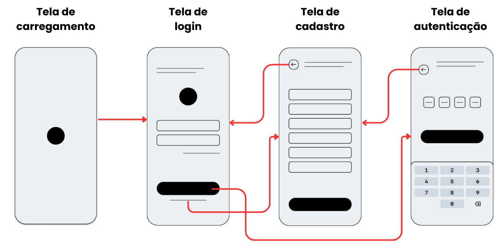
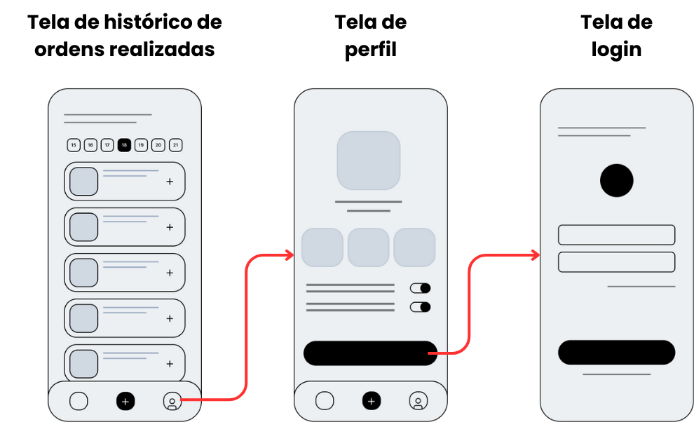
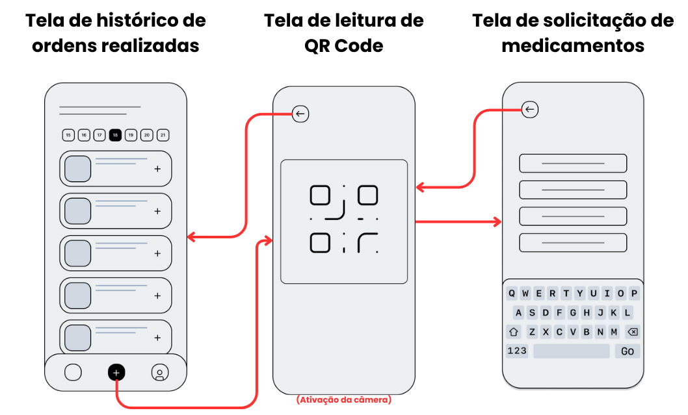
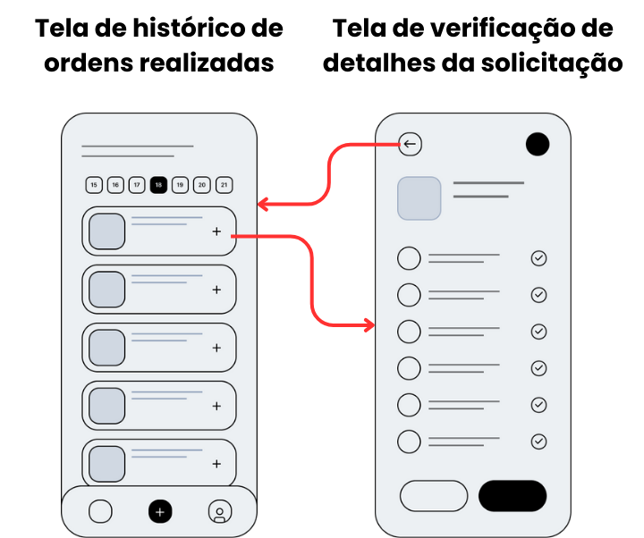
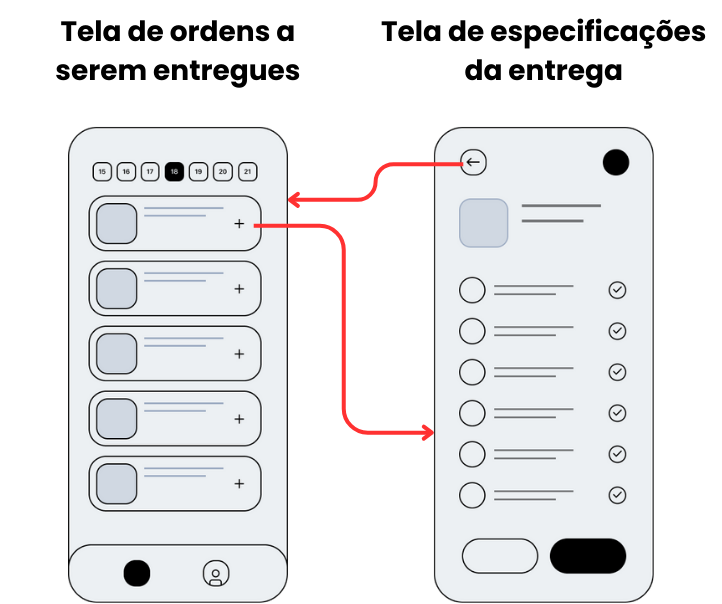

# Wireframe

Para orientar o desenvolvimento do aplicativo, criamos um wireframe de baixa fidelidade. Este wireframe é uma representação visual simplificada da interface de usuário, composta principalmente por elementos básicos, como caixas, linhas e texto, sem incluir detalhes visuais ou estilísticos, sendo o foco principal a estrutura e no layout das páginas. Essa etapa foi essencial para planejar a estrutura do aplicativo e validar o fluxo de navegação com nosso parceiro.

A prototipação abordou o fluxo de dois perfis de usuário distintos: **técnicos de enfermagem**, encarregados das solicitações de medicamentos, e **assistentes da farmácia**, responsáveis pela reposição dos estoques de medicamentos.

## Fluxos comum entre os perfils de usuários

### Entrada na aplicação

**Logo na carregamento**: Na tela principal, há uma bola preta no topo que serve como logo. Esta localização estratégica ajuda os usuários a associar rapidamente o aplicativo à marca, fortalecendo a identidade visual.

**Tela de Login**: Os campos de entrada para login estão localizados na tela de uma forma que caem sob a região do polegar quando o dispositivo é segurado com uma mão, tornando o acesso mais conveniente.

**Tela de Cadastro**: Caso o usuário não seja cadastrado é possível acessar uma tela de cadastro para se registrar na plataforma. Sua construção foi baseada em padrões de design comumente utilizados no mercado, visando aproveitar a familiaridade dos usuários com esses padrões. 

**Tela de autenticação**: Para reforçar a segurança da aplicação, será implementado um sistema de autenticação baseado em tokens enviados por mensagem de texto e/ou e-mail. A construção da tela foi orientada por padrões amplamente utilizados em outras aplicações, dos quais os usuários já estão familiarizados com o funcionamento. 

### Perfil do usuário

**Tela de histórico de ordens realizadas**: Para acessar o perfil do usuário, será possível clicar em um dos ícones na barra de navegação. A escolha do ícone foi feita baseado na familiaridade para os usuários, seguindo um padrão reconhecível quando se trata de visualizar um perfil.

**Tela de perfil**: Na tela de perfil, os usuários poderão visualizar informações sobre si mesmos e definir configurações personalizadas, como o tamanho da fonte e o modo noturno ou diurno do aplicativo. Além disso, haverá um botão de logout para deslogar da aplicação. Isso proporcionará uma experiência mais personalizada e permitirá que os usuários gerenciem suas preferências de maneira eficaz.

**Tela de login**: Ao clicar em logout o usuário será encaminhado para a tela de login já apresentada previamente.

## Fluxos de uso do técnico de enfermagem

### Solicitação de medicamentos

**Tela de histórico de ordens realizadas**: Ao entrar na aplicação o usuário terá acesso a solicitações que realizou organizadas. A barra de navegação será posicionada na parte inferior da interface, dentro do alcance natural do polegar. Um botão destacado está situado na parte central inferior de cada tela, permitindo que os usuários acessem facilmente a função principal do aplicativo, a leitura de QR code, otimizando a experiência para uso com uma mão.

**Tela de leitura de QR Code**: Ao iniciar o processo de solitação de medicamento a câmera do celular será ativada para a realizar a leitura de um QR Code identificador do Pyxi. O uso deste método incorpora um procedimento que os usuários já conhecem, assim evitando a necessidade de reeducação e preservando a continuidade na experiência do usuário.

**Tela de solicitação de medicamentos**: Após a identificação do Pyxi o usuário será encaminhado para um formulário simples de solicitação de medicamentos, identificando o fármaco, quantidade e demais informações necessárias.

### Verificação de detalhes da solicitação

**Tela de histórico de ordens realizadas**: A lista de pedidos segue um layout padrão organizado por data, semelhante ao utilizado em aplicativos como o iFood. Essa abordagem de design é intuitiva e aumenta a eficiência na busca de informações passadas. Ao clicar em uma solicitação será possível ver mais detalhes da ordem feita.

**Tela de verificação de detalhes da solicitação**: Na tela de verificação de detalhes da solitação será possível visualizar medicamentos, data e horários de solicitação, status e demais informações sobre o pedido.

## Fluxos de uso do assistente da farmácia

**Tela de ordens a serem entregues**: Parecida visualmente com a tela de histórico de ordens realizadas apresentada previamente, a tela de ordens a serem entregues tem o propósito de organizar as entregas que devem ser feitas pelo assistente de farmácia. Sua organização será feita em formato de lista para garantir a familiaridade de uso.

**Tela de especificações da entrega**: Ao clicar em um pedido, o usuário terá acesso a informações detalhadas, incluindo os remédios solicitados, suas quantidades, números de lote e outras informações relevantes. Além disso, será possível marcar a entrega como concluída para atualizar o status do pedido

## Conclusão

Acima, foram explorados os diversos fluxos de casos de uso da aplicação, priorizando a estrutura e funcionalidades essenciais. A utilização de wireframes de baixa fidelidade se revela como uma prática que otimiza tempo e recursos, evitando investimentos excessivos em detalhes visuais que podem ser ajustados posteriormente. Essa abordagem não apenas ajuda a identificar precocemente questões de usabilidade e navegação, mas também facilita a validação com os parceiros de projeto. Em síntese, a prototipação é um estágio crucial no processo de design de aplicativos, proporcionando uma visualização rápida e econômica da sua estrutura, facilitando a obtenção de feedback e promovendo economia de tempo e recursos a longo prazo.
